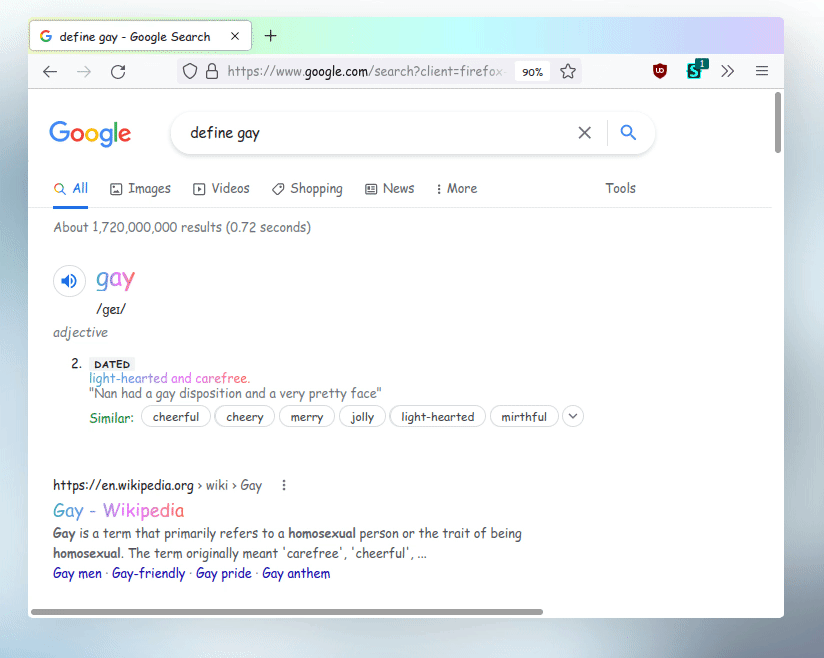

  

# Themes

Note: these themes go best with the Comic Sans MS font.  
Note: magenta has been removed from gaycord, but I'm too lazy to redo the gifs.

[Discord (gaycord)](./gaycord.css)  
[Firefox (gayfox)](./gayfox.css)  
[Google (gaygle)](./gaygle.css)  

# HALP!? How install?!?

## Websites
 - gaycord (web client)
 - gaygle

1. Install Stylus - [Chrome](https://chrome.google.com/webstore/detail/stylus/clngdbkpkpeebahjckkjfobafhncgmne?hl=en) / [Firefox](https://addons.mozilla.org/en-US/firefox/addon/styl-us)
2. Go to the site that the style is made for
3. Click the stylus icon to open a popup
4. Near the bottom, click the domain name (as in, `site.com`, not the things after)
5. Paste the contents of the file you want
6. Save, and enjoy.  This is an order.

## Gaycord (bad version) (electron / desktop app)
[DiscoCSS (Linux-only)](https://github.com/mlvzk/discocss)  
powercord / betterdiscord / something else, PR if you wanna fix this section.

Remember to remove the first/last lines in this case.

## gayfox
1. Enable `toolkit.legacyUserProfileCustomizations.stylesheets` in `about:config`
2. Go to your profile directory by going to `about:support` and looking for "Profile Directory"
3. Once you're in that dir, make a subdir called `chrome`
4. In the `chrome` subdir, put the contents of `gayfox.css` into a file called `userChrome.css` (With those capitals)
5. Restart firefox
